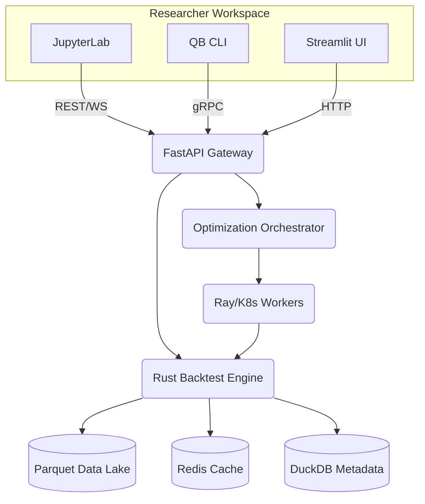
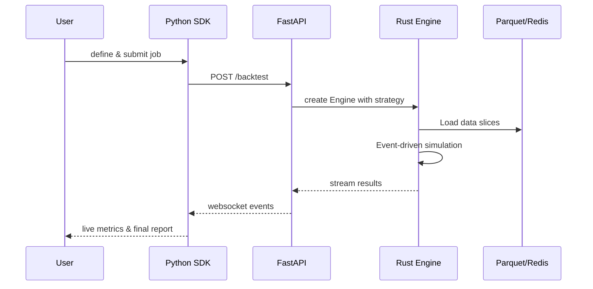

GlowBack is built as a **Rust-first** quantitative backtesting platform with a layered architecture designed for speed, accuracy, and extensibility.

## Architectural pillars

The system is organized around four core principles:

1. **Ultra-realistic market simulation** with microstructure awareness
2. **ML-ready interfaces** for seamless integration with Python ML frameworks
3. **Built-in statistical robustness** checks and validation
4. **Performance-first design** using Rust for the critical path

## Core components

GlowBack's architecture consists of three primary layers:

### Engine layer (Rust)

The heart of GlowBack is written in Rust for maximum performance and memory safety:

- **gb-engine**: Event-driven backtesting engine with realistic execution simulation
- **gb-types**: Core domain types (orders, positions, portfolios, strategies)
- **gb-data**: Data ingestion, storage (Parquet/Arrow), and caching

**Performance target:** Backtest 10 years of daily data for 500 equities in under 60 seconds on an 8-core machine.

### API layer (Python)

FastAPI-based REST API provides async operations and OpenAPI documentation:

- **gb-python**: PyO3 Python bindings with zero-copy Arrow interop
- Strategy development SDK (`qb.Api`) with event-driven API
- JupyterLab integration for research workflows

### Storage layer

Columnar storage optimized for time-series data:

- **Parquet files** for compressed columnar storage
- **Apache Arrow** for in-memory zero-copy operations
- **DuckDB** for local analytics and metadata
- **Redis Cluster** for hot data caching (millisecond latency)

## System architecture diagram



## Technology stack

| Layer | Technology | Purpose |
|-------|-----------|----------|
| **Core Engine** | Rust (Arrow + Parquet) | Speed, memory safety |
| **API Layer** | FastAPI (Python) | Async, OpenAPI docs |
| **Worker Orchestration** | Ray on Kubernetes | Horizontal scalability |
| **Metadata DB** | DuckDB / PostgreSQL | Local analytics / shared environments |
| **Object Storage** | Parquet files | Durable, columnar compression |
| **Cache** | Redis Cluster | Sub-millisecond read path |
| **Frontend** | Streamlit (PoC) / React (production) | Local validation / cloud dashboard |
| **Python Tooling** | uv | Fast, deterministic dependency management |

## Data flow

The typical backtest execution follows this sequence:



## Crate organization

The source code is organized into focused Rust crates:

```
crates/
├── gb-types/       # Core domain types
│   ├── market.rs   # Symbols, bars, market events
│   ├── orders.rs   # Orders, fills, execution
│   ├── portfolio.rs # Positions, P&L tracking
│   ├── strategy.rs  # Strategy trait and implementations
│   └── backtest.rs  # Backtest configuration and results
│
├── gb-engine/      # Event-driven backtesting engine
│   ├── engine.rs   # Main simulation loop
│   ├── execution.rs # Order execution and slippage
│   └── simulator.rs # Market simulation
│
├── gb-data/        # Data management
│   ├── providers.rs # Data source adapters
│   ├── storage.rs   # Parquet file I/O
│   ├── catalog.rs   # DuckDB metadata catalog
│   ├── loaders.rs   # Data loading utilities
│   └── cache.rs     # Redis caching layer
│
└── gb-python/      # Python bindings (PyO3)
    └── lib.rs       # FFI bridge to Rust
```

## Design principles

### Event-driven simulation

GlowBack uses a chronological event-driven architecture rather than vectorized backtesting. This ensures:

- Realistic order timing and execution
- No look-ahead bias
- Accurate simulation of market microstructure

### Zero-copy data sharing

Apache Arrow enables zero-copy data sharing between:

- Rust engine and Python strategies
- Parquet files and in-memory processing
- CPU and GPU (for ML model inference)

### Deterministic execution

All backtests are fully reproducible:

- Reproducible random seeds
- Results hash stored in metadata
- UTC nanosecond timestamps (no timezone ambiguity)

## Scalability

### Horizontal scaling

- Stateless API pods for REST/WebSocket endpoints
- Ray workers for distributed parameter optimization
- KEDA autoscaling based on queue depth

### Vertical optimization

- SIMD operations via Arrow columnar processing
- Rayon for multi-threaded single-run speed
- Memory-mapped Parquet files for large datasets

### Storage footprint

- ≤ 1 TB for 10 years of tick data across 1,000 symbols
- ZSTD compression for Parquet files
- Delta Lake / Iceberg for time-travel and versioning

## Deployment models

### Local development

Run entirely on your laptop:

```bash
# Install with local UI
uv pip install glowback[ui]

# Launch Streamlit interface
qb ui
```

### Cloud deployment

Production deployment uses:

- **Kubernetes (AKS)** for container orchestration
- **Azure Blob Storage** for data lake
- **PostgreSQL** for shared metadata
- **GitHub Actions** for CI/CD
- **Argo CD** for GitOps deployment

## Next steps

<CardGroup cols={2}>
  <Card title="Event-driven simulation" icon="clock" href="/concepts/event-driven-simulation">
    Learn how the backtesting engine processes events chronologically
  </Card>
  <Card title="Market data" icon="database" href="/concepts/market-data">
    Understand data ingestion, storage, and caching
  </Card>
  <Card title="Portfolio management" icon="wallet" href="/concepts/portfolio-management">
    Explore position tracking and P&L calculation
  </Card>
  <Card title="Getting started" icon="rocket" href="/quickstart">
    Run your first backtest
  </Card>
</CardGroup>
