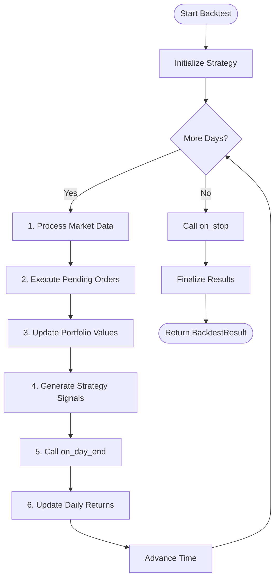

GlowBack uses an **event-driven architecture** for backtesting, processing market data chronologically to ensure realistic simulation and eliminate look-ahead bias.

## Why event-driven?

Unlike vectorized backtesting frameworks that process entire data arrays at once, event-driven simulation:

- **Prevents look-ahead bias**: Strategies only see data available at that point in time
- **Models realistic execution**: Order fills happen sequentially, not instantaneously
- **Supports complex strategies**: Multi-asset portfolios with interdependent signals
- **Enables accurate microstructure**: Slippage, latency, and market impact modeling

<Info>
**Performance note:** GlowBack targets sub-60-second backtests for 10 years of daily data across 500 equities on an 8-core machine, despite the event-driven overhead.
</Info>

## Engine architecture

The core engine (`gb-engine/src/engine.rs`) orchestrates the simulation loop:

```rust
pub struct Engine {
    config: BacktestConfig,
    portfolio: Portfolio,
    strategy: Box<dyn Strategy>,
    current_time: DateTime<Utc>,
    market_data: HashMap<Symbol, Vec<Bar>>,
    pending_orders: Vec<Order>,
    strategy_metrics: StrategyMetrics,
    equity_curve: Vec<EquityCurvePoint>,
}
```

### Key components

| Component | Purpose | Location |
|-----------|---------|----------|
| **Engine** | Main simulation orchestrator | `gb-engine/src/engine.rs:16` |
| **Strategy** | User-defined trading logic | `gb-types/src/strategy.rs` |
| **Portfolio** | Position and cash tracking | `gb-types/src/portfolio.rs` |
| **Execution** | Order filling and slippage | `gb-engine/src/execution.rs` |
| **Market Data** | Bar/tick data buffers | `gb-types/src/market.rs` |

## Simulation loop

The engine processes each timestamp in chronological order:



### Step-by-step execution

From `gb-engine/src/engine.rs:116-176`:

```rust
pub async fn run(&mut self) -> GbResult<BacktestResult> {
    // Initialize strategy with merged config
    self.strategy.initialize(&strategy_config)?;

    // Main simulation loop
    self.current_time = self.config.start_date;
    
    while self.current_time <= self.config.end_date {
        // 1. Process market data for current time
        self.process_market_data().await?;
        
        // 2. Execute pending orders
        self.execute_pending_orders().await?;
        
        // 3. Update portfolio with current market prices
        self.update_portfolio_values().await?;
        
        // 4. Generate strategy signals
        self.generate_strategy_signals().await?;
        
        // 5. Call strategy's on_day_end
        self.call_strategy_day_end().await?;
        
        // 6. Update daily returns
        self.update_daily_returns().await?;
        
        // Advance time
        self.current_time += Duration::days(1);
    }
    
    // Cleanup
    self.call_strategy_stop().await?;
    self.finalize_results(&mut result).await?;
    
    Ok(result)
}
```

## Event types

GlowBack processes three main event categories:

### Market events

Defined in `gb-types/src/market.rs`:

```rust
pub enum MarketEvent {
    Bar(Bar),           // OHLCV bar (1-min, daily, etc.)
    Tick(Tick),         // Individual price tick
    Quote(Quote),       // Bid/ask quote update
}
```

**Bar structure:**

```rust
pub struct Bar {
    pub symbol: Symbol,
    pub timestamp: DateTime<Utc>,
    pub open: Decimal,
    pub high: Decimal,
    pub low: Decimal,
    pub close: Decimal,
    pub volume: Decimal,
    pub resolution: Resolution,
}
```

### Order events

Defined in `gb-types/src/orders.rs`:

```rust
pub enum OrderEvent {
    OrderSubmitted { order_id: OrderId },
    OrderFilled { order_id: OrderId, fill: Fill },
    OrderCanceled { order_id: OrderId, reason: String },
    OrderRejected { order_id: OrderId, reason: String },
}
```

**Fill structure:**

```rust
pub struct Fill {
    pub order_id: OrderId,
    pub symbol: Symbol,
    pub side: Side,
    pub quantity: Decimal,
    pub price: Decimal,
    pub commission: Decimal,
    pub executed_at: DateTime<Utc>,
    pub strategy_id: String,
}
```

### Strategy events

Strategies receive callbacks at key moments:

| Callback | Trigger | Purpose |
|----------|---------|----------|
| `initialize()` | Before simulation starts | Load parameters, set up indicators |
| `on_market_event()` | New bar/tick arrives | Generate trading signals |
| `on_order_event()` | Order fills/cancels | Update internal state |
| `on_day_end()` | End of trading day | Rebalancing, risk checks |
| `on_stop()` | Backtest complete | Cleanup, final logging |

## Strategy context

Each callback receives a `StrategyContext` with complete market and portfolio state:

```rust
pub struct StrategyContext {
    pub strategy_id: String,
    pub current_time: DateTime<Utc>,
    pub portfolio: Portfolio,
    pub market_data: HashMap<Symbol, MarketDataBuffer>,
    pub pending_orders: Vec<Order>,
    pub initial_capital: Decimal,
}
```

**MarketDataBuffer** provides historical lookback:

```rust
pub struct MarketDataBuffer {
    symbol: Symbol,
    events: VecDeque<MarketEvent>,
    max_size: usize,
}

impl MarketDataBuffer {
    pub fn latest_bar(&self) -> Option<&Bar>;
    pub fn bars(&self, count: usize) -> Vec<&Bar>;
    pub fn close_prices(&self, count: usize) -> Vec<Decimal>;
}
```

## Order execution

From `gb-engine/src/engine.rs:199-274`, orders are executed with realistic simulation:

### Execution logic

```rust
async fn try_execute_order(&self, order: &Order) -> GbResult<Option<Fill>> {
    if let Some(bars) = self.market_data.get(&order.symbol) {
        for bar in bars {
            if bar.timestamp.date_naive() == self.current_time.date_naive() {
                // Execute at open price (configurable)
                let execution_price = bar.open;
                
                let fill = Fill::new(
                    order.id,
                    order.symbol.clone(),
                    order.side,
                    order.quantity,
                    execution_price,
                    calculate_commission(&order),
                    order.strategy_id.clone(),
                );
                
                return Ok(Some(fill));
            }
        }
    }
    Ok(None)
}
```

### Execution models

The engine supports configurable execution realism (from `gb-engine/src/execution.rs`):

- **Market orders**: Execute at next available price (open, close, etc.)
- **Limit orders**: Fill only when price crosses limit
- **Stop orders**: Trigger when stop price reached
- **Slippage**: Basis points of spread or custom function
- **Commissions**: Fixed + per-share fees
- **Latency**: Configurable per-symbol delay

<Warning>
By default, orders execute at the **open price** of the next bar. Configure execution timing via `ExecutionConfig` for more realistic fills.
</Warning>

## Time handling

From the design document and `AGENTS.md`:

- **Internal timestamps**: UTC nanoseconds (no timezone ambiguity)
- **Chronological ordering**: Events processed strictly in time order
- **Daylight saving aware**: UTC avoids DST anomalies

```rust
// All timestamps are UTC
pub timestamp: DateTime<Utc>

// Advance simulation time deterministically
self.current_time += Duration::days(1);
```

## Performance optimizations

### SIMD and parallelism

- **Arrow columnar processing**: SIMD operations on price arrays
- **Rayon**: Multi-threaded single-run execution
- **Ray workers**: Distributed parameter optimization

### Memory efficiency

- **Memory-mapped Parquet**: Lazy load data slices
- **Ring buffers**: Fixed-size market data windows
- **Zero-copy Arrow**: Share data between Rust and Python

### Caching strategy

From `gb-data/src/cache.rs`:

1. **Redis Cluster**: Hot symbols (millisecond latency)
2. **Parquet files**: Warm data (sub-second load)
3. **Data providers**: Cold data (fetch on demand)

## Example: Strategy signal generation

Here's how a strategy generates signals during simulation:

```python
from glowback import Strategy, StrategyContext, MarketEvent

class MovingAverageCrossover(Strategy):
    def on_market_event(self, event: MarketEvent, context: StrategyContext):
        if not isinstance(event, Bar):
            return []
        
        # Get historical data from context
        buffer = context.market_data[event.symbol]
        closes = buffer.close_prices(50)
        
        if len(closes) < 50:
            return []  # Not enough data yet
        
        # Calculate moving averages
        sma_10 = sum(closes[-10:]) / 10
        sma_50 = sum(closes) / 50
        
        # Generate signal
        if sma_10 > sma_50 and not context.portfolio.has_position(event.symbol):
            # Golden cross - buy signal
            order = Order.market(
                symbol=event.symbol,
                side=Side.Buy,
                quantity=100,
                strategy_id=self.strategy_id
            )
            return [StrategyAction.PlaceOrder(order)]
        
        return []
```

**Execution flow:**

1. Engine processes bar at timestamp T
2. Calls `strategy.on_market_event()` with bar and context
3. Strategy accesses historical data via `context.market_data`
4. Strategy returns `PlaceOrder` action
5. Engine adds order to `pending_orders`
6. On next step, engine executes order at market price

## Determinism

All backtests are fully reproducible:

- **Reproducible seeds**: Random number generators seeded per run
- **Results hash**: Stored in metadata database
- **Event ordering**: Strictly chronological across all symbols

```rust
// Deterministic random seed
let mut rng = StdRng::seed_from_u64(self.config.random_seed);
```

## Next steps

<CardGroup cols={2}>
  <Card title="Market data" icon="database" href="/concepts/market-data">
    Learn about data loading and caching
  </Card>
  <Card title="Portfolio management" icon="wallet" href="/concepts/portfolio-management">
    Understand position tracking and P&L
  </Card>
  <Card title="Build a strategy" icon="code" href="/guides/strategy-development">
    Create your first trading strategy
  </Card>
  <Card title="Architecture" icon="diagram-project" href="/concepts/architecture">
    System architecture overview
  </Card>
</CardGroup>
