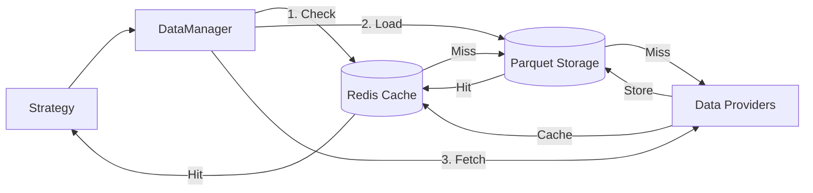

GlowBack uses a layered data architecture with **Parquet/Arrow storage** for performance and **Redis caching** for low-latency access.

## Data architecture

The data management system (`gb-data`) provides a three-tier storage hierarchy:



### Data flow

From `gb-data/src/lib.rs:50-90`:

```rust
pub async fn load_data(
    &mut self,
    symbol: &Symbol,
    start_date: DateTime<Utc>,
    end_date: DateTime<Utc>,
    resolution: Resolution,
) -> GbResult<Vec<Bar>> {
    // 1. Check cache first
    if let Some(data) = self.cache.get_bars(symbol, start_date, end_date, resolution).await? {
        return Ok(data);
    }
    
    // 2. Try local storage
    if let Ok(data) = self.storage.load_bars(symbol, start_date, end_date, resolution).await {
        self.cache.store_bars(symbol, &data, resolution).await?;
        return Ok(data);
    }
    
    // 3. Fetch from providers
    for provider in &mut self.providers {
        if provider.supports_symbol(symbol) {
            if let Ok(data) = provider.fetch_bars(symbol, start_date, end_date, resolution).await {
                // Store and cache
                self.storage.save_bars(symbol, &data, resolution).await?;
                self.cache.store_bars(symbol, &data, resolution).await?;
                
                // Update catalog
                self.catalog.register_symbol_data(symbol, start_date, end_date, resolution).await?;
                
                return Ok(data);
            }
        }
    }
    
    Err(DataError::NoDataInRange { /* ... */ }.into())
}
```

## Storage layer

### Parquet files

GlowBack stores all historical data in **Parquet** format for:

- **Columnar compression**: 10-100x size reduction vs CSV
- **Predicate pushdown**: Query only needed columns/rows
- **Schema evolution**: Add fields without rewriting data
- **Arrow compatibility**: Zero-copy interop with in-memory processing

**Storage layout:**

```
data_root/
├── {exchange}/
│   ├── {asset_class}/
│   │   ├── {symbol}/
│   │   │   ├── Day.parquet
│   │   │   ├── Hour.parquet
│   │   │   ├── Minute.parquet
│   │   │   └── Tick.parquet
```

**Path generation** from `gb-data/src/storage.rs:34-40`:

```rust
fn get_storage_path(&self, symbol: &Symbol, resolution: Resolution) -> PathBuf {
    self.data_root
        .join(&symbol.exchange)
        .join(format!("{:?}", symbol.asset_class))
        .join(&symbol.symbol)
        .join(format!("{}.parquet", resolution))
}
```

### Schema definition

From `gb-data/src/storage.rs`, the Parquet schema uses Arrow data types:

```rust
fn get_schema() -> Arc<Schema> {
    Arc::new(Schema::new(vec![
        Field::new("symbol", DataType::Utf8, false),
        Field::new("timestamp", DataType::Timestamp(TimeUnit::Nanosecond, None), false),
        Field::new("open", DataType::Decimal128(18, 8), false),
        Field::new("high", DataType::Decimal128(18, 8), false),
        Field::new("low", DataType::Decimal128(18, 8), false),
        Field::new("close", DataType::Decimal128(18, 8), false),
        Field::new("volume", DataType::Int64, false),
        Field::new("resolution", DataType::Utf8, false),
    ]))
}
```

**Key design choices:**

- **Decimal128(18,8)**: Exact price representation (no floating-point errors)
- **Timestamp nanoseconds**: Microsecond-precision timestamps in UTC
- **Non-nullable fields**: All data points required for integrity

### Writing Parquet files

From `gb-data/src/storage.rs:42-73`:

```rust
pub async fn save_bars(
    &self,
    symbol: &Symbol,
    bars: &[Bar],
    resolution: Resolution,
) -> GbResult<()> {
    let storage_path = self.get_storage_path(symbol, resolution);
    
    // Ensure parent directory exists
    if let Some(parent) = storage_path.parent() {
        fs::create_dir_all(parent)?;
    }
    
    let schema = Self::get_schema();
    
    let writer = ArrowWriter::try_new(
        fs::File::create(&storage_path)?,
        schema,
        Some(WriterProperties::builder().build()),
    )?;
    
    let record_batch = Self::bars_to_record_batch(bars)?;
    writer.write(&record_batch)?;
    writer.close()?;
    
    Ok(())
}
```

### Reading Parquet files

From `gb-data/src/storage.rs:75-120`:

```rust
pub async fn load_bars(
    &self,
    symbol: &Symbol,
    start_date: DateTime<Utc>,
    end_date: DateTime<Utc>,
    resolution: Resolution,
) -> GbResult<Vec<Bar>> {
    let storage_path = self.get_storage_path(symbol, resolution);
    
    if !storage_path.exists() {
        return Err(DataError::SymbolNotFound { symbol: symbol.to_string() }.into());
    }
    
    let file = fs::File::open(&storage_path)?;
    let reader = ParquetRecordBatchReaderBuilder::try_new(file)?
        .build()?;
    
    let mut bars = Vec::new();
    
    for batch_result in reader {
        let batch = batch_result?;
        bars.extend(Self::record_batch_to_bars(&batch, symbol)?);  
    }
    
    // Filter by date range
    bars.retain(|bar| bar.timestamp >= start_date && bar.timestamp <= end_date);
    
    Ok(bars)
}
```

<Info>
Parquet files are **memory-mapped** during reads for efficient access to large datasets without loading everything into RAM.
</Info>

## Caching layer

### Redis architecture

From the design document, GlowBack uses **Redis Cluster** for hot data:

- **Sub-millisecond latency** for most-recent symbol data
- **LRU eviction** for automatic memory management
- **Sharding by symbol** for horizontal scaling

**Cache key format:**

```
bars:{symbol}:{resolution}:{start_date}:{end_date}
```

### Cache implementation

From `gb-data/src/cache.rs`:

```rust
pub struct CacheManager {
    // Redis client for caching
    client: Option<redis::Client>,
}

impl CacheManager {
    pub async fn get_bars(
        &self,
        symbol: &Symbol,
        start_date: DateTime<Utc>,
        end_date: DateTime<Utc>,
        resolution: Resolution,
    ) -> GbResult<Option<Vec<Bar>>> {
        // Check Redis cache
        // Return None if not cached
    }
    
    pub async fn store_bars(
        &mut self,
        symbol: &Symbol,
        bars: &[Bar],
        resolution: Resolution,
    ) -> GbResult<()> {
        // Store in Redis with TTL
    }
}
```

## Data catalog

### DuckDB metadata

The catalog (`gb-data/src/catalog.rs`) uses **DuckDB** for lightweight analytics:

- Track which symbols/date ranges are available
- Query metadata without scanning Parquet files
- Support SQL-based data discovery

```rust
pub struct DataCatalog {
    conn: Connection,  // DuckDB connection
}

impl DataCatalog {
    pub async fn register_symbol_data(
        &mut self,
        symbol: &Symbol,
        start_date: DateTime<Utc>,
        end_date: DateTime<Utc>,
        resolution: Resolution,
    ) -> GbResult<()> {
        // Insert metadata record
    }
}
```

**Catalog schema:**

```sql
CREATE TABLE symbol_data (
    symbol TEXT,
    exchange TEXT,
    asset_class TEXT,
    resolution TEXT,
    start_date TIMESTAMP,
    end_date TIMESTAMP,
    record_count INTEGER,
    file_path TEXT,
    created_at TIMESTAMP,
    PRIMARY KEY (symbol, resolution)
);
```

## Data providers

### Provider interface

From `gb-data/src/providers.rs`:

```rust
#[async_trait]
pub trait DataProvider: Send + Sync {
    fn name(&self) -> &str;
    
    fn supports_symbol(&self, symbol: &Symbol) -> bool;
    
    async fn fetch_bars(
        &mut self,
        symbol: &Symbol,
        start_date: DateTime<Utc>,
        end_date: DateTime<Utc>,
        resolution: Resolution,
    ) -> GbResult<Vec<Bar>>;
}
```

### Built-in providers

From the design document:

| Provider | Coverage | Notes |
|----------|----------|-------|
| **Local CSV** | All | For custom datasets |
| **Alpaca Markets** | US equities, crypto | Free tier available |
| **Polygon.io** | US equities, forex, crypto | Premium historical data |
| **Yahoo Finance** | Global equities | Free but rate-limited |

**Adding a provider:**

```rust
let mut data_manager = DataManager::new().await?;

// Add Alpaca provider
let alpaca = AlpacaProvider::new(api_key, api_secret);
data_manager.add_provider(Box::new(alpaca));
```

## Data types

### Bar (OHLCV)

From `gb-types/src/market.rs`:

```rust
pub struct Bar {
    pub symbol: Symbol,
    pub timestamp: DateTime<Utc>,
    pub open: Decimal,
    pub high: Decimal,
    pub low: Decimal,
    pub close: Decimal,
    pub volume: Decimal,
    pub resolution: Resolution,
}
```

### Resolution

```rust
pub enum Resolution {
    Tick,        // Individual trades
    Second,      // 1-second bars
    Minute,      // 1-minute bars
    FiveMinute,  // 5-minute bars
    FifteenMinute,
    ThirtyMinute,
    Hour,        // 1-hour bars
    Day,         // Daily bars
    Week,        // Weekly bars
    Month,       // Monthly bars
}
```

### Symbol

```rust
pub struct Symbol {
    pub symbol: String,
    pub exchange: String,
    pub asset_class: AssetClass,
}

pub enum AssetClass {
    Equity,
    Crypto,
    Forex,
    Future,
    Option,
}
```

**Helper constructors:**

```rust
Symbol::equity("AAPL")          // US equity
Symbol::crypto("BTC-USD")       // Cryptocurrency
Symbol::forex("EUR/USD")        // Forex pair
```

## Arrow integration

### Zero-copy data sharing

GlowBack uses **Apache Arrow** for in-memory representation:

```rust
use arrow::array::{ArrayRef, Decimal128Array, TimestampNanosecondArray};
use arrow::record_batch::RecordBatch;

// Convert Bars to Arrow RecordBatch
fn bars_to_record_batch(bars: &[Bar]) -> Result<RecordBatch> {
    let timestamps: Vec<i64> = bars.iter()
        .map(|b| b.timestamp.timestamp_nanos())
        .collect();
    
    let closes: Vec<i128> = bars.iter()
        .map(|b| (b.close * Decimal::from(100_000_000)).to_i128().unwrap())
        .collect();
    
    let timestamp_array = Arc::new(TimestampNanosecondArray::from(timestamps)) as ArrayRef;
    let close_array = Arc::new(Decimal128Array::from(closes)) as ArrayRef;
    
    RecordBatch::try_new(schema, vec![timestamp_array, close_array])
}
```

**Python interop:**

```python
import pyarrow as pa
from glowback import DataManager

# Load data as Arrow table (zero-copy)
data_manager = DataManager()
bars_table = data_manager.load_arrow(
    symbol="AAPL",
    start_date="2020-01-01",
    end_date="2023-12-31",
)

# Convert to Pandas/NumPy without copying
df = bars_table.to_pandas()
prices = bars_table['close'].to_numpy()
```

## Storage footprint

From the design document:

- **Target**: ≤ 1 TB for 10 years of tick data across 1,000 symbols
- **Compression**: ZSTD-compressed Parquet (10-100x vs CSV)
- **Deduplication**: Delta Lake/Iceberg for incremental updates

**Example sizes:**

| Resolution | Symbols | Duration | Size (compressed) |
|------------|---------|----------|-------------------|
| Daily | 500 | 10 years | ~50 MB |
| 1-minute | 100 | 1 year | ~5 GB |
| Tick | 10 | 1 month | ~10 GB |

## Performance optimizations

### Predicate pushdown

Parquet supports **column pruning** and **row filtering** at the storage layer:

```rust
// Only read 'close' column for date range
let reader = ParquetRecordBatchReaderBuilder::try_new(file)?
    .with_projection(vec![5])  // Column index for 'close'
    .with_row_filter(date_filter)  // Only load rows in range
    .build()?;
```

### Lazy loading

Data is loaded **on-demand** during simulation:

```rust
// Engine loads data for current timestamp window only
for bar in bars.iter() {
    if bar.timestamp >= self.current_time && 
       bar.timestamp < self.current_time + window_size {
        process_bar(bar);
    }
}
```

### Parallel loading

Multiple symbols loaded concurrently:

```rust
use rayon::prelude::*;

let bars: HashMap<Symbol, Vec<Bar>> = symbols
    .par_iter()
    .map(|symbol| {
        let bars = data_manager.load_data(symbol, start, end, resolution).await?;
        Ok((symbol.clone(), bars))
    })
    .collect()?;
```

## Data versioning

From the design document, GlowBack supports:

- **Delta Lake** transaction logs for ACID updates
- **Apache Iceberg** table format for schema evolution
- **Time-travel queries** for reproducible backtests

```python
# Load data as of specific date
bars = data_manager.load_data(
    symbol="AAPL",
    start_date="2020-01-01",
    end_date="2023-12-31",
    as_of="2024-01-01",  # Data snapshot date
)
```

## Next steps

<CardGroup cols={2}>
  <Card title="Portfolio management" icon="wallet" href="/concepts/portfolio-management">
    Learn about position tracking and P&L calculation
  </Card>
  <Card title="Event-driven simulation" icon="clock" href="/concepts/event-driven-simulation">
    Understand the backtesting engine
  </Card>
  <Card title="Data providers" icon="cloud-arrow-down" href="/guides/data-sources">
    Configure external data sources
  </Card>
  <Card title="Architecture" icon="diagram-project" href="/concepts/architecture">
    System architecture overview
  </Card>
</CardGroup>
