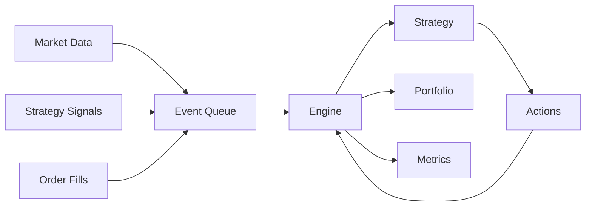

GlowBack provides a high-performance, event-driven backtesting engine that simulates realistic trading conditions including slippage, commissions, and latency.

## Quick start

Run a backtest with the built-in buy-and-hold strategy:

```rust
use gb_engine::BacktestEngine;
use gb_types::*;
use rust_decimal::Decimal;
use chrono::{DateTime, Utc};

// Create strategy configuration
let mut strategy_config = StrategyConfig::new(
    "buy_and_hold".to_string(),
    "Buy and Hold".to_string()
);
strategy_config.symbols = vec![Symbol::equity("AAPL")];
strategy_config.initial_capital = Decimal::from(100000);

// Create backtest configuration
let mut config = BacktestConfig::new(
    "My First Backtest".to_string(),
    strategy_config
);
config.start_date = DateTime::parse_from_rfc3339("2024-01-01T00:00:00Z")?
    .with_timezone(&Utc);
config.end_date = DateTime::parse_from_rfc3339("2024-12-31T00:00:00Z")?
    .with_timezone(&Utc);
config.symbols = vec![Symbol::equity("AAPL")];
config.resolution = Resolution::Day;
config.initial_capital = Decimal::from(100000);

// Run backtest
let mut engine = BacktestEngine::new(config).await?;
let result = engine.run_with_strategy(Box::new(BuyAndHoldStrategy::new())).await?;

println!("Final portfolio value: ${}", result.final_portfolio.unwrap().total_equity);
```

## Backtest configuration

Configure backtests with comprehensive settings:

### Basic settings

```rust
let mut config = BacktestConfig::new(
    "Strategy Test".to_string(),
    strategy_config
);

// Set date range
config.start_date = start;
config.end_date = end;

// Set initial capital
config.initial_capital = Decimal::from(100000);

// Set symbols to trade
config.symbols = vec![
    Symbol::equity("AAPL"),
    Symbol::equity("GOOGL"),
    Symbol::equity("MSFT"),
];

// Set data resolution
config.resolution = Resolution::Day;
```

### Execution settings

Configure realistic trading costs and slippage:

```rust
config.execution_settings = ExecutionSettings {
    commission_per_share: Decimal::new(1, 3),  // $0.001 per share
    commission_percentage: Decimal::new(5, 4),  // 0.05%
    minimum_commission: Decimal::new(1, 0),     // $1.00 minimum
    slippage_model: SlippageModel::Linear { basis_points: 5 },
    latency_model: LatencyModel::Fixed { milliseconds: 100 },
    market_impact_model: MarketImpactModel::SquareRoot {
        factor: Decimal::new(1, 4)
    },
};
```

<Tabs>
  <Tab title="Slippage models">
    Control how execution price differs from quoted price:
    
    ```rust
    // No slippage (unrealistic)
    SlippageModel::None
    
    // Fixed slippage
    SlippageModel::Fixed { basis_points: 5 }  // 0.05% slippage
    
    // Linear slippage (proportional to order size)
    SlippageModel::Linear { basis_points: 5 }
    
    // Square root slippage (more realistic for large orders)
    SlippageModel::SquareRoot { factor: Decimal::new(1, 4) }
    
    // Volume-weighted slippage
    SlippageModel::VolumeWeighted { min_bps: 2, max_bps: 10 }
    ```
  </Tab>
  
  <Tab title="Latency models">
    Simulate order execution delays:
    
    ```rust
    // No latency (unrealistic)
    LatencyModel::None
    
    // Fixed latency
    LatencyModel::Fixed { milliseconds: 100 }
    
    // Random latency
    LatencyModel::Random { min_ms: 50, max_ms: 200 }
    
    // Venue-specific latency
    let mut venues = HashMap::new();
    venues.insert("NASDAQ".to_string(), 80);
    venues.insert("NYSE".to_string(), 100);
    LatencyModel::VenueSpecific { venues }
    ```
  </Tab>
  
  <Tab title="Market impact">
    Model how large orders move the market:
    
    ```rust
    // No market impact
    MarketImpactModel::None
    
    // Linear impact (unrealistic for large orders)
    MarketImpactModel::Linear { factor: Decimal::new(1, 5) }
    
    // Square root impact (realistic)
    MarketImpactModel::SquareRoot { factor: Decimal::new(1, 4) }
    
    // Logarithmic impact
    MarketImpactModel::Logarithmic { factor: Decimal::new(2, 4) }
    ```
  </Tab>
</Tabs>

### Data settings

Configure data handling:

```rust
config.data_settings = DataSettings {
    data_source: "alpha_vantage".to_string(),
    adjust_for_splits: true,
    adjust_for_dividends: true,
    fill_gaps: false,
    survivor_bias_free: true,
    max_bars_in_memory: 10000,
};
```

<AccordionGroup>
  <Accordion title="Survivor bias">
    When `survivor_bias_free` is `true`, the backtest includes delisted companies and failed stocks. This provides more realistic results, as strategies tested only on surviving companies tend to show inflated performance.
  </Accordion>
  
  <Accordion title="Corporate actions">
    - `adjust_for_splits`: Adjust historical prices for stock splits
    - `adjust_for_dividends`: Adjust prices for dividend distributions
    
    These adjustments ensure price continuity and prevent false signals from corporate actions.
  </Accordion>
  
  <Accordion title="Data gaps">
    When `fill_gaps` is `true`, missing data points are interpolated. Set to `false` for more realistic backtests that handle missing data explicitly.
  </Accordion>
</AccordionGroup>

## Running backtests

<Steps>

<Step title="Create the backtest engine">
  ```rust
  let mut engine = BacktestEngine::new(config).await?;
  ```
</Step>

<Step title="Run with your strategy">
  ```rust
  let strategy = Box::new(MovingAverageCrossoverStrategy::new(10, 20));
  let result = engine.run_with_strategy(strategy).await?;
  ```
</Step>

<Step title="Analyze results">
  ```rust
  if let Some(portfolio) = result.final_portfolio {
      println!("Final value: ${}", portfolio.total_equity);
      println!("Total return: {:.2}%",
          portfolio.get_total_return() * Decimal::from(100)
      );
  }
  
  if let Some(metrics) = result.performance_metrics {
      println!("Sharpe ratio: {:.2}", metrics.sharpe_ratio.unwrap_or_default());
      println!("Max drawdown: {:.2}%", metrics.max_drawdown * Decimal::from(100));
  }
  ```
</Step>

</Steps>

## Backtest results

The `BacktestResult` contains comprehensive performance data:

```rust
pub struct BacktestResult {
    pub id: BacktestId,
    pub config: BacktestConfig,
    pub status: BacktestStatus,
    pub start_time: DateTime<Utc>,
    pub end_time: Option<DateTime<Utc>>,
    pub duration_seconds: Option<u64>,
    pub final_portfolio: Option<Portfolio>,
    pub strategy_metrics: Option<StrategyMetrics>,
    pub performance_metrics: Option<PerformanceMetrics>,
    pub equity_curve: Vec<EquityCurvePoint>,
    pub trade_log: Vec<TradeRecord>,
    pub error_message: Option<String>,
}
```

### Equity curve

Access the equity curve to plot portfolio value over time:

```rust
for point in &result.equity_curve {
    println!("{}: ${} (return: {:.2}%, drawdown: {:.2}%)",
        point.timestamp.format("%Y-%m-%d"),
        point.portfolio_value,
        point.cumulative_return * Decimal::from(100),
        point.drawdown * Decimal::from(100)
    );
}
```

### Trade log

Analyze individual trades:

```rust
for trade in &result.trade_log {
    if let Some(pnl) = trade.pnl {
        println!("{} {} shares of {} at ${} -> ${} (P&L: ${})",
            if trade.side == Side::Buy { "Bought" } else { "Sold" },
            trade.quantity,
            trade.symbol,
            trade.entry_price,
            trade.exit_price.unwrap_or_default(),
            pnl
        );
    }
}
```

## Event-driven architecture

GlowBack uses an event-driven architecture for realistic simulation:



Events are processed chronologically across all symbols, ensuring realistic timing and preventing look-ahead bias.

## Python API

Run backtests from Python using the simplified API:

```python
import glowback as gb

# Quick backtest with buy-and-hold
result = gb.run_buy_and_hold(
    symbols=["AAPL", "GOOGL", "MSFT"],
    start_date="2024-01-01T00:00:00Z",
    end_date="2024-12-31T00:00:00Z",
    resolution="day",
    initial_capital=100000,
    name="My Backtest"
)

# Print results
print(f"Final value: ${result.metrics_summary['final_value']:,.2f}")
print(f"Total return: {result.metrics_summary['total_return']:.2f}%")
print(f"Sharpe ratio: {result.metrics_summary['sharpe_ratio']:.2f}")
print(f"Max drawdown: {result.metrics_summary['max_drawdown']:.2f}%")

# Plot equity curve
result.plot_equity(show=True)
```

For more control, use the full engine:

```python
import glowback as gb

# Create engine
engine = gb.BacktestEngine(
    symbols=["AAPL"],
    start_date="2024-01-01T00:00:00Z",
    end_date="2024-12-31T00:00:00Z",
    resolution="day",
    initial_capital=100000
)

# Run backtest
result = engine.run_buy_and_hold()

# Convert to pandas DataFrame
df = result.to_dataframe(index="timestamp")
print(df.head())

# Get metrics as DataFrame
metrics_df = result.metrics_dataframe()
print(metrics_df)
```

## Best practices

<AccordionGroup>
  <Accordion title="Use realistic execution settings">
    Always include commissions, slippage, and latency to avoid overfitting. Unrealistic assumptions lead to strategies that fail in live trading.
  </Accordion>
  
  <Accordion title="Test on multiple time periods">
    Run backtests across different market regimes (bull markets, bear markets, high volatility periods) to ensure robustness.
  </Accordion>
  
  <Accordion title="Avoid overfitting">
    Split your data into training and testing periods. Parameters optimized on training data should be validated on out-of-sample testing data.
  </Accordion>
  
  <Accordion title="Account for survivorship bias">
    Enable `survivor_bias_free` to include delisted stocks. Testing only on survivors inflates performance metrics.
  </Accordion>
  
  <Accordion title="Monitor trade frequency">
    Strategies with very high trade frequency may not be practical due to execution costs and market impact. Check the trade log for realism.
  </Accordion>
</AccordionGroup>

## Next steps

<CardGroup cols={2}>
  <Card title="Performance analytics" icon="chart-bar" href="/guides/performance-analytics">
    Deep dive into performance metrics
  </Card>
  <Card title="Strategy development" icon="code" href="/guides/strategy-development">
    Build custom strategies
  </Card>
</CardGroup>
