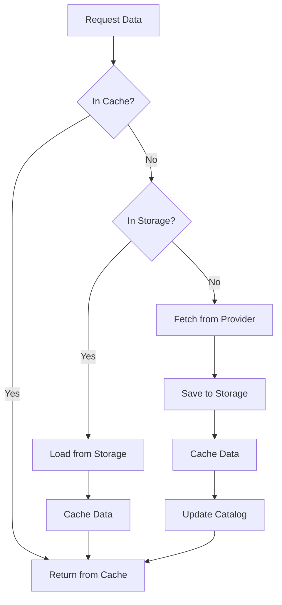

GlowBack supports multiple data sources through a flexible provider system. Data providers can fetch market data from CSV files, APIs, databases, or generate synthetic data for testing.

## Data manager

The `DataManager` coordinates all data operations and manages multiple providers:

```rust
use gb_data::DataManager;

let mut data_manager = DataManager::new().await?;
```

The data manager handles:
- **Catalog**: Metadata about available symbols and date ranges
- **Storage**: Parquet files for efficient data storage
- **Cache**: In-memory cache for frequently accessed data
- **Providers**: Multiple data sources with fallback support

## Available providers

### CSV provider

Load market data from local CSV files:

```rust
use gb_data::CsvDataProvider;

let csv_provider = CsvDataProvider::new("/path/to/data")
    .with_pattern("{symbol}_{resolution}.csv");

data_manager.add_provider(Box::new(csv_provider));
```

#### CSV file format

CSV files should contain OHLCV data with headers:

```csv
Date,Open,High,Low,Close,Volume
2024-01-01,150.00,152.50,149.75,151.25,80000000
2024-01-02,151.50,153.00,151.00,152.75,75000000
2024-01-03,152.50,154.25,152.00,153.50,82000000
```

<Note>
  The CSV provider supports both lowercase and capitalized headers (e.g., `date` or `Date`, `open` or `Open`).
</Note>

#### File naming patterns

Customize the file naming pattern using placeholders:

<CodeGroup>

```rust Default pattern
let provider = CsvDataProvider::new("/data")
    .with_pattern("{symbol}_{resolution}.csv");
// Looks for: AAPL_day.csv, GOOGL_day.csv
```

```rust Exchange-specific
let provider = CsvDataProvider::new("/data")
    .with_pattern("{exchange}/{symbol}.csv");
// Looks for: NASDAQ/AAPL.csv, NYSE/SPY.csv
```

```rust Custom format
let provider = CsvDataProvider::new("/data")
    .with_pattern("{symbol}_daily_data.csv");
// Looks for: AAPL_daily_data.csv
```

</CodeGroup>

### Sample data provider

Generate synthetic data for testing and demos:

```rust
use gb_data::SampleDataProvider;

let sample_provider = SampleDataProvider::new();
data_manager.add_provider(Box::new(sample_provider));
```

The sample provider supports common symbols:

<Tabs>
  <Tab title="Equities">
    - AAPL (Apple)
    - GOOGL (Alphabet)
    - MSFT (Microsoft)
    - TSLA (Tesla)
    - SPY (S&P 500 ETF)
  </Tab>
  <Tab title="Crypto">
    - BTC-USD / BTCUSDT (Bitcoin)
    - ETH-USD / ETHUSDT (Ethereum)
    - SOL-USD / SOLUSDT (Solana)
    - DOGE-USD / DOGEUSDT (Dogecoin)
    - ADA-USD / ADAUSDT (Cardano)
  </Tab>
</Tabs>

<Warning>
  Sample data is randomly generated and should only be used for testing. Do not use it for actual trading decisions.
</Warning>

### Alpha Vantage provider

Fetch real market data from Alpha Vantage API:

```rust
use gb_data::AlphaVantageProvider;

let av_provider = AlphaVantageProvider::new(
    "YOUR_API_KEY".to_string()
);
data_manager.add_provider(Box::new(av_provider));
```

<Steps>

<Step title="Get an API key">
  Sign up for a free API key at [alphavantage.co](https://www.alphavantage.co/support/#api-key)
</Step>

<Step title="Configure the provider">
  ```rust
  let provider = AlphaVantageProvider::new(api_key);
  data_manager.add_provider(Box::new(provider));
  ```
</Step>

<Step title="Fetch data">
  The provider automatically fetches data when needed:
  ```rust
  let bars = data_manager.load_data(
      &Symbol::equity("AAPL"),
      start_date,
      end_date,
      Resolution::Day,
  ).await?;
  ```
</Step>

</Steps>

<Note>
  The free tier of Alpha Vantage supports daily data only. Intraday data requires a premium subscription.
</Note>

## Loading market data

Load market data for a symbol and date range:

```rust
use gb_types::{Symbol, Resolution};
use chrono::{DateTime, Utc};

let symbol = Symbol::equity("AAPL");
let start_date = DateTime::parse_from_rfc3339("2024-01-01T00:00:00Z")?
    .with_timezone(&Utc);
let end_date = DateTime::parse_from_rfc3339("2024-12-31T00:00:00Z")?
    .with_timezone(&Utc);

let bars = data_manager.load_data(
    &symbol,
    start_date,
    end_date,
    Resolution::Day,
).await?;

println!("Loaded {} bars for {}", bars.len(), symbol);
```

## Data flow

The data manager uses a multi-tier caching strategy:

<Steps>

<Step title="Check in-memory cache">
  First, check if data is already in the memory cache for fast access.
</Step>

<Step title="Check storage">
  If not cached, check local Parquet storage for previously fetched data.
</Step>

<Step title="Fetch from providers">
  If not in storage, iterate through configured providers to fetch the data.
</Step>

<Step title="Store and cache">
  Save fetched data to storage and cache for future use.
</Step>

<Step title="Update catalog">
  Update the metadata catalog with symbol information and date ranges.
</Step>

</Steps>



## Creating custom providers

Implement the `DataProvider` trait to create custom data sources:

```rust
use async_trait::async_trait;
use gb_types::{Bar, Symbol, Resolution, GbResult};
use chrono::{DateTime, Utc};

#[derive(Debug)]
pub struct CustomProvider {
    name: String,
}

#[async_trait]
impl DataProvider for CustomProvider {
    fn supports_symbol(&self, symbol: &Symbol) -> bool {
        // Return true if this provider can fetch data for the symbol
        true
    }

    async fn fetch_bars(
        &mut self,
        symbol: &Symbol,
        start_date: DateTime<Utc>,
        end_date: DateTime<Utc>,
        resolution: Resolution,
    ) -> GbResult<Vec<Bar>> {
        // Implement data fetching logic
        // Return a vector of Bar structs
        todo!("Implement data fetching")
    }

    fn name(&self) -> &str {
        &self.name
    }

    fn config(&self) -> serde_json::Value {
        serde_json::json!({
            "type": "custom",
            "name": self.name
        })
    }
}
```

## Provider priority

Providers are checked in the order they are added. Add more reliable providers first:

```rust
// Try local CSV first (fastest)
data_manager.add_provider(Box::new(CsvDataProvider::new("/data")));

// Then try Alpha Vantage (real data, but rate limited)
data_manager.add_provider(Box::new(AlphaVantageProvider::new(api_key)));

// Finally fall back to sample data
data_manager.add_provider(Box::new(SampleDataProvider::new()));
```

## Catalog statistics

Get information about available data:

```rust
let stats = data_manager.catalog.get_catalog_stats().await?;

println!("Total symbols: {}", stats.total_symbols);
println!("Total records: {}", stats.total_records);
println!("Date range: {} to {}",
    stats.earliest_date.unwrap().to_rfc3339(),
    stats.latest_date.unwrap().to_rfc3339()
);
```

## Python API

Data providers are also available in Python:

<CodeGroup>

```python CSV provider
import glowback as gb

dm = gb.DataManager()
dm.add_csv_provider("/path/to/data")

symbol = gb.Symbol("AAPL", "NASDAQ", "equity")
bars = dm.load_data(
    symbol,
    "2024-01-01T00:00:00Z",
    "2024-12-31T00:00:00Z",
    "day"
)
```

```python Sample provider
import glowback as gb

dm = gb.DataManager()
dm.add_sample_provider()

symbol = gb.Symbol("AAPL", "NASDAQ", "equity")
bars = dm.load_data(
    symbol,
    "2024-01-01T00:00:00Z",
    "2024-12-31T00:00:00Z",
    "day"
)
```

```python Alpha Vantage
import glowback as gb

dm = gb.DataManager()
dm.add_alpha_vantage_provider("YOUR_API_KEY")

symbol = gb.Symbol("AAPL", "NASDAQ", "equity")
bars = dm.load_data(
    symbol,
    "2024-01-01T00:00:00Z",
    "2024-12-31T00:00:00Z",
    "day"
)
```

</CodeGroup>

## Next steps

<CardGroup cols={2}>
  <Card title="Strategy development" icon="code" href="/guides/strategy-development">
    Build custom trading strategies
  </Card>
  <Card title="Backtesting" icon="chart-line" href="/guides/backtesting">
    Test strategies with historical data
  </Card>
</CardGroup>
